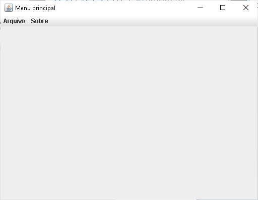
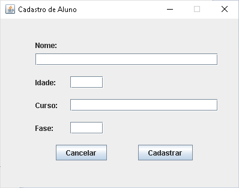
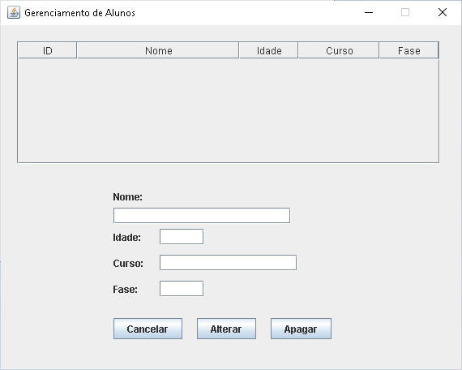

# Interface Gráfica para o Cadastro de Aluno usando um DAO com MySQL usando a IDE NetBeans.

## Contextualização

 - Esta é uma versão do sistema para a IDE NetBeans.<br> 
 - O projeto no NetBeans deve ser chamado CadastroAlunoMySQLDAO.<br>
 - Os dados estão armazenados no banco de dados MySQL.<br>
 - Este programa possui diversas classes organizada nos pacotes, principal, visao, dao e modelo.<br>
 - A pasta src contêm os fontes do projeto.<br>
 - A interface gráfica foi construída **com** o auxílio da IDE NetBeans.<br>

### Banco de dados

- Abaixo o script para a criação do banco de dados e da tabela. O script completo está no arquivo [banco.sql](banco.sql).

```
#criar o database chamado db_alunos
create database if not exists db_alunos;

#entrar no database db_alunos
use db_alunos;

#remove a tabela para recriá-la
drop table if exists tb_alunos;

#cria a tabela de tb_alunos
CREATE TABLE tb_alunos ( 
    id      INTEGER NOT NULL, 
    nome    VARCHAR(100), 
    idade   INTEGER,
    curso   VARCHAR(50),
    fase    INTEGER,
    PRIMARY KEY(id)
);

```

### Interface gráfica

## Tela do menu principal do programa.


## Tela para cadastrar novos alunos.


## Tela para gerenciar alunos (alterar e apagar).


## Arquivos

- banco.sql - Script do banco de dados.
- pom.xml - Arquivo de configuração da ferramenta de automação Maven.
- *.png - Arquivos de imagens do README.md.